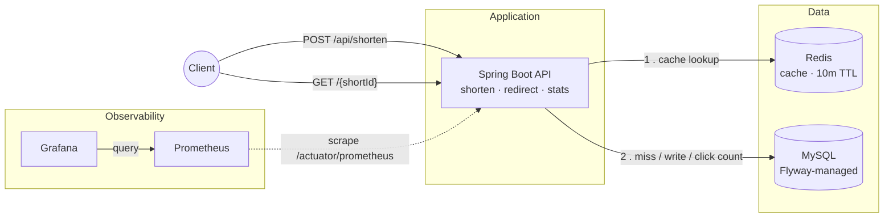

# URL Shortener

[](https://github.com/Mrvishal2k2/url-shortener/actions/workflows/ci.yml)

A URL shortener REST API built with Java 21 and Spring Boot 4 — backed by MySQL, cached in Redis, with metrics exposed to Prometheus and Grafana.

## Features

- Short URL creation with auto-generated or custom IDs
- 302 redirects with click tracking
- Per-link stats (clicks, created/expiry timestamps)
- Link expiry (30 days by default) and deletion
- URL validation — scheme whitelist, rejects malformed and non-HTTP links
- Redis cache-aside on the redirect path, with fallback to MySQL if Redis is down
- Flyway-managed schema
- Consistent JSON error responses with meaningful HTTP status codes
- OpenAPI / Swagger UI
- Prometheus metrics + provisioned Grafana dashboard

## Tech Stack

| | |
|---|---|
| Language | Java 21 |
| Framework | Spring Boot 4 (WebMVC, Data JPA, Validation, Actuator) |
| Database | MySQL 8 |
| Cache | Redis 7 |
| Migrations | Flyway |
| Docs | springdoc-openapi (Swagger UI) |
| Observability | Micrometer → Prometheus → Grafana |
| Testing | JUnit 5, Mockito, Testcontainers |
| Build | Maven |

## Quick Start

Requires Docker. Everything else runs in containers.

```bash
docker compose up --build
```

| Service | URL |
|---|---|
| API | http://localhost:8080 |
| Swagger UI | http://localhost:8080/swagger-ui.html |
| Prometheus | http://localhost:9090 |
| Grafana | http://localhost:3000 |

Stop with `docker compose down`, or `docker compose down -v` to also wipe the database volume.

## API Documentation

Full API reference is served by Swagger UI at **http://localhost:8080/swagger-ui.html** once the stack is running.

Every endpoint, request body, response schema, and status code is documented there and generated from the code, so it never goes stale. Use **Try it out** on any endpoint to send real requests straight from the browser — no `curl` or Postman needed.

The raw OpenAPI spec is at `/v3/api-docs` if you want to import it into another tool or generate a client.

## Observability

### Prometheus — http://localhost:9090

The app exposes Micrometer metrics at `/actuator/prometheus`, scraped every 15 seconds. Use the **Graph** tab to query directly, for example:

```promql
sum(rate(http_server_requests_seconds_count[1m]))
```

**Status → Target health** shows whether the app is being scraped successfully.

### Grafana — http://localhost:3000

Log in with `admin` / `admin`. The Prometheus datasource and the **URL Shortener — Overview** dashboard (in the `Shortener` folder) are provisioned automatically from `grafana/` — nothing to configure on first run.

The dashboard covers:

- Request rate, error rate, heap usage, and CPU at a glance
- Requests and average latency broken down per endpoint
- JVM memory, HikariCP connection pool, threads and GC

Credentials can be overridden with `GRAFANA_USER` / `GRAFANA_PASSWORD`.

## Architecture



A redirect checks Redis first and falls back to MySQL on a miss. Click counts always go to MySQL as an atomic increment, so they stay correct even when the lookup is served from cache. If Redis is unreachable, requests fall through to MySQL instead of failing.

## Design Notes

**Cache-aside on redirects.** Redirects are the hot path, so `shortId → URL` lookups are cached in Redis with a 10-minute TTL. Only a small immutable record is cached — not the JPA entity — so the cache doesn't break when the entity changes shape. Expiry is re-checked in memory after the cache read, so an expired link still returns `410` even on a cache hit.

**Redis failures don't take down the API.** A `CacheErrorHandler` logs cache errors and falls through to MySQL, so Redis being unavailable degrades performance instead of causing outages.

**Click counting is a single atomic UPDATE.** `UPDATE ... SET click_count = click_count + 1` instead of read-modify-write, which avoids lost updates under concurrent hits. It also stays outside the cached lookup, so counting keeps working on cache hits.

**Validation happens before anything is stored.** URLs are parsed with `java.net.URI` and checked against an `http`/`https` whitelist rather than matched with a regex — this rejects `javascript:` and `data:` URLs, which would otherwise be a stored-XSS vector in a link shortener.

**Schema is versioned.** Flyway owns the schema and Hibernate is set to `validate`, so the entity and the database can't silently drift apart.

## Configuration

Defaults are for local development; Docker overrides them via environment variables.

| Property | Env var | Default |
|---|---|---|
| `spring.datasource.url` | `SPRING_DATASOURCE_URL` | `jdbc:mysql://localhost:3306/urlshortener` |
| `spring.datasource.username` | `SPRING_DATASOURCE_USERNAME` | `root` |
| `spring.datasource.password` | `SPRING_DATASOURCE_PASSWORD` | *(empty)* |
| `spring.data.redis.host` | `SPRING_DATA_REDIS_HOST` | `localhost` |
| `server.port` | `APP_PORT` | `8080` |
| `app.base-url` | `APP_BASE_URL` | `http://localhost:8080` |
| `app.expiry-guest-days` | — | `30` |

## Running Locally Without Docker

Needs MySQL and Redis running on their default ports, and a `urlshortener` database.

```bash
./mvnw spring-boot:run
```

## Tests

```bash
./mvnw verify
```


Unit tests cover the service, controllers, and ID generation with Mockito. Integration tests use Testcontainers, so Docker must be running.

## Scope of Improvement

- User accounts, with longer expiry for registered users
- Rate limiting
- Advanced analytics based on click source
- Pagination for `/api/all`
- Minimal frontend, with a wait-based redirect page

## License

[MIT](LICENSE)
